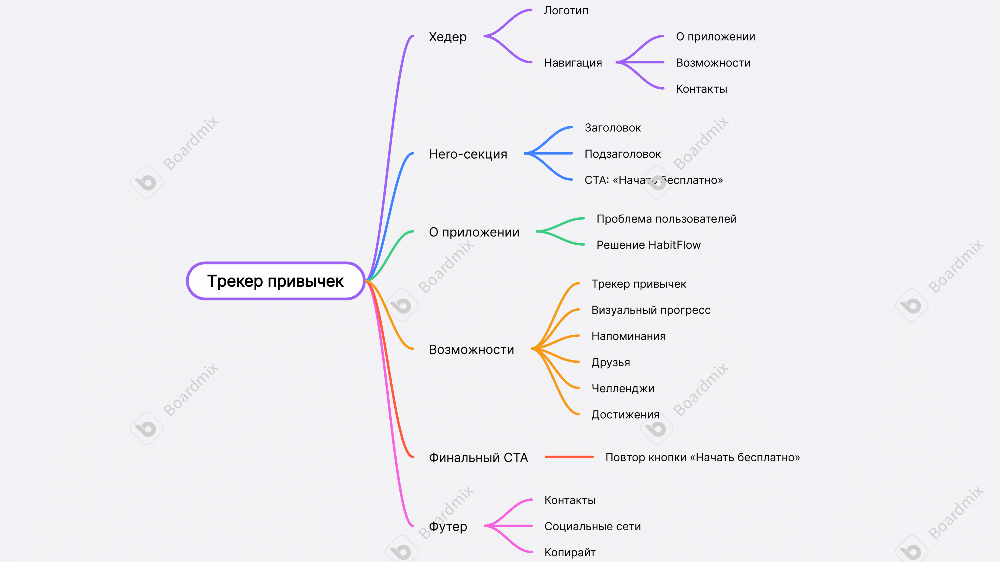

# HabitTracker
Минималистичный одностраничный лендинг веб трекера привычек.

## О проекте
HabitTracker — это концепт мобильного приложения для формирования полезных привычек.
Проект ориентирован на простоту использования, визуальный прогресс и социальную мотивацию.
Лендинг демонстрирует структуру интерфейса и основные возможности продукта.

## MindMap
Ниже представлена карта сайта, отражающая структуру лендинга и основные блоки страницы

## Используемые технологии

- HTML5
- CSS-фреймворк **Bulma**

## Ссылка на проект
GitHub Pages:
